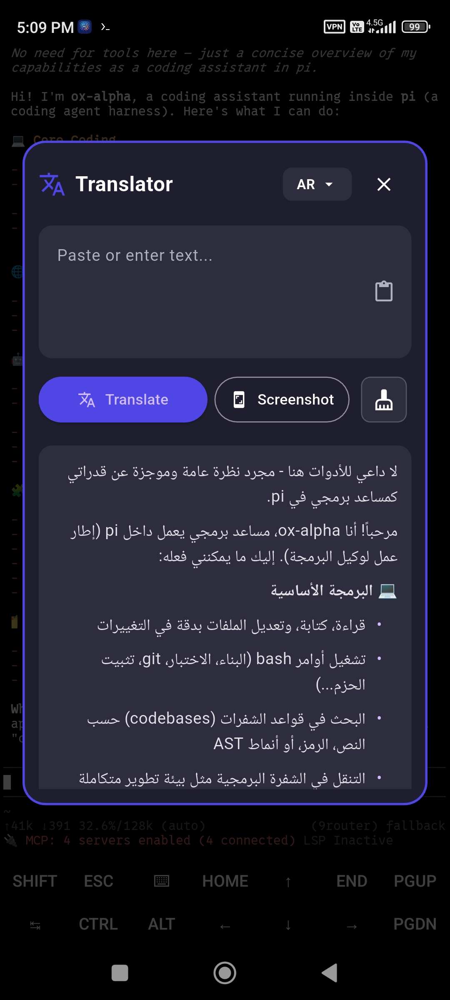
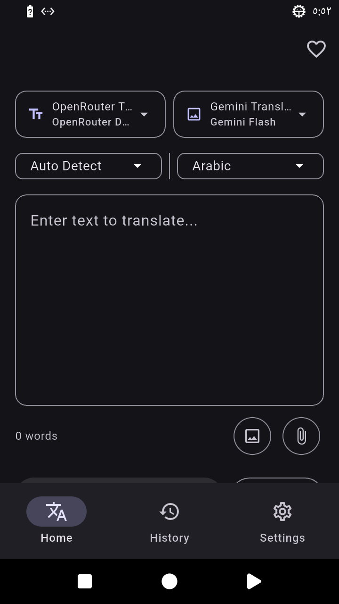
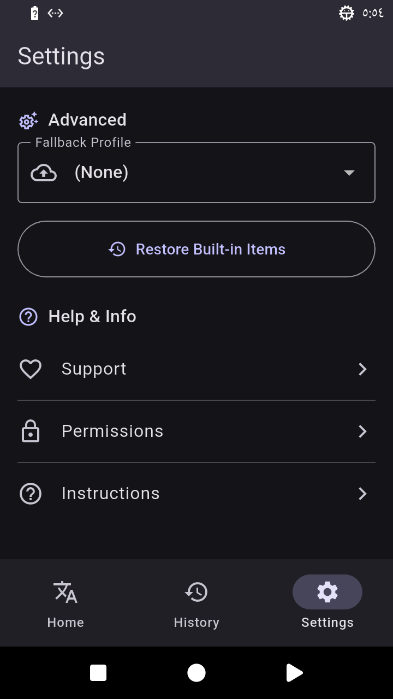
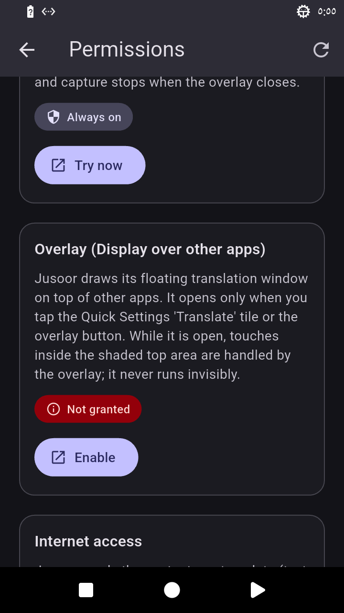
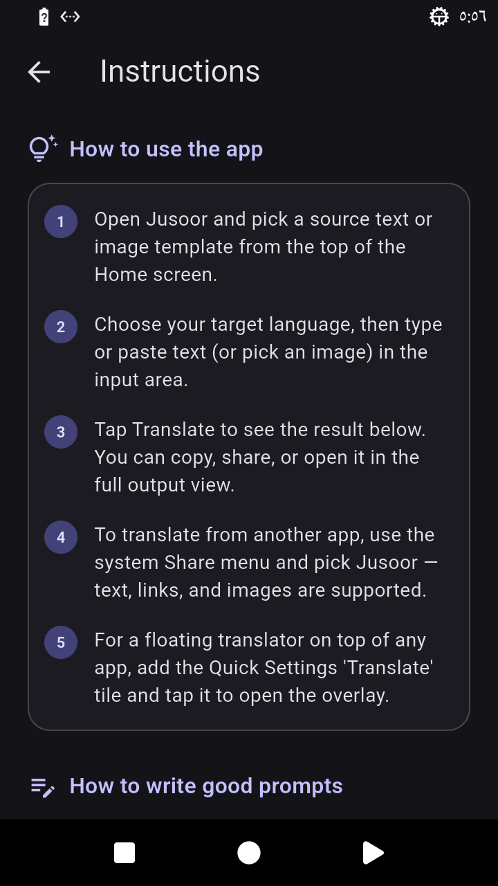
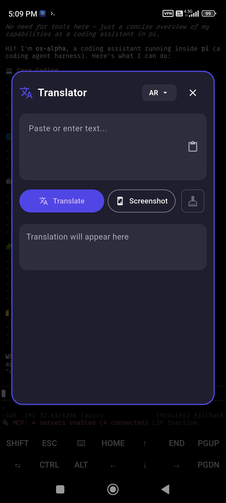

# Jusoor · جسور

**Bridge the language gap — AI translation that floats above any app.**

[](LICENSE)
[](https://www.android.com/)
[](https://dart.dev/)
[](CONTRIBUTING.md)

Jusoor (Arabic for *bridges*) is a free, open-source Android app that puts AI
translation in a floating overlay above any other app — select, screenshot,
share, or paste text and images and translate them through the LLM provider of
your choice.

<p align="center">
  
</p>
<p align="center"><em>Jusoor's overlay floating above Termux — translating the on-screen text in place.</em></p>

| Home | Settings |
|---|---|
|  |  |
| **Permissions** | **Instructions** |
|  |  |
| **Overlay (empty)** | **Overlay (translated)** |
|  |  |

## Quick tile in action

Watch how the **Quick Settings tile** launches the floating overlay, opens it
on top of any app, and translates text in place — no copying, no switching
apps:

<p align="center">
  <video src="docs/quick-tile-demo.mp4" width="320" controls></video>
</p>
<p align="center"><em>The overlay summoned from the Quick Settings tile — translate anything, anywhere.</em></p>

## What is Jusoor?

Jusoor is built for moments when you are inside another app and hit a language
you do not read: instead of switching apps, you summon Jusoor's overlay on top
of whatever you are doing and get an instant translation. It is Arabic-first
(full RTL interface) with full English support, and you stay in control — you
bring your own API keys, stored only on your device.

- **Translate over anything** — a floating overlay works above other apps;
  start and stop it from a Quick Settings tile.
- **Text & image input** — type or paste text, pick an image, or share content
  straight into Jusoor from any app.
- **29 languages + Auto Detect** — pick your target language; the source is
  detected automatically.
- **Prompt templates** — reusable templates with `{{target_language}}`
  substitution (or send it literally with the per-template toggle).
- **Bring your own provider** — Google Gemini, OpenRouter, or any
  OpenAI-compatible endpoint (Ollama, LM Studio, vLLM, …).
- **Translation history** — every result is saved, searchable, and shareable.
- **Arabic-first UI** — complete RTL layout, English secondary, instant locale
  switch from Settings.
- **Private by design** — API keys live on-device via secure storage; requests
  go directly from your phone to your provider. No middleman server.

## Why these permissions?

Jusoor asks only for what its features need. Honest inventory:

| Permission | Why Jusoor needs it |
| --- | --- |
| `INTERNET` | Reaches your configured AI provider. Granted at install time. |
| `SYSTEM_ALERT_WINDOW` | Draws the overlay above other apps — the core feature; special system grant. |
| `FOREGROUND_SERVICE` | Keeps the overlay alive while you use other apps. |
| `FOREGROUND_SERVICE_SPECIAL_USE` | Declares the overlay's foreground-service type (Android requirement). |
| `FOREGROUND_SERVICE_MEDIA_PROJECTION` | Powers screenshot translate; each capture needs explicit system consent. |
| `POST_NOTIFICATIONS` | Overlay service notification (Android 13+). |
| `WAKE_LOCK` | Merged in by the overlay plugin; keeps the overlay responsive. |

The in-app **Permissions** page shows the live grant status of each permission
with one-tap shortcuts to grant or revoke.

## Download & Install

**Prebuilt APK:** see [Releases](https://github.com/digitaltrekkerr/jusoor/releases)
— coming with the first public release.

**Build from source:**

Prerequisites:

- Flutter SDK (stable channel; the project targets Dart SDK `^3.10.8`)
- Android SDK — compiles against API 36, runs on Android 8.0+ (API 26)
- [Melos](https://pub.dev/packages/melos) (`dart pub global activate melos`)

```bash
git clone https://github.com/digitaltrekkerr/jusoor.git
cd jusoor
melos bootstrap        # links workspace packages via pubspec overrides
cd translation_app
flutter run            # with a device or emulator connected
```

For a release build: `flutter build apk --release` (signing config lives in
`translation_app/android/app/build.gradle`).

## Architecture

Melos monorepo — one app plus four focused packages:

| Path | Role |
| --- | --- |
| `translation_app/` | The Flutter app: screens, l10n (AR/EN), Riverpod state, Android overlay integration. |
| `packages/translation_core/` | Provider clients (Gemini, OpenRouter, OpenAI-compatible), models, templates. |
| `packages/file_handler/` | File reading and MIME detection for shared/imported files. |
| `packages/history/` | Translation history persistence and queries. |
| `packages/markdown_renderer/` | BiDi-aware Markdown rendering of translation results. |

## Contributing

Contributions are welcome! Please read [CONTRIBUTING.md](CONTRIBUTING.md)
first. Run `melos analyze` and `melos test` before opening a pull request.

## Security

Found a vulnerability? Please do **not** open a public issue — follow the
reporting process in [SECURITY.md](SECURITY.md).

## License

Released under the [MIT License](LICENSE).

## Support 💜

If Jusoor saves you time, consider supporting development on
[Patreon](https://www.patreon.com/cw/DigitalTrekkerr/membership), and give the
repo a ⭐ if you find it useful.

---

<div dir="rtl">

# جسور · Jusoor

**عبر فجوة اللغات — ترجمة بالذكاء الاصطناعي تطفو فوق أي تطبيق.**

جسور تطبيق أندرويد مجاني ومفتوح المصدر يضع قوة الترجمة بالذكاء الاصطناعي في
نافذة عائمة فوق أي تطبيق آخر: انسخ أو التقط شاشة أو شارك نصاً أو صورة، واحصل
على ترجمتها فوراً عبر مزوّد الذكاء الاصطناعي الذي تختاره بنفسك.

| Home | Settings |
|---|---|
|  |  |
| **Permissions** | **Instructions** |
|  |  |

## ما هو جسور؟

صُمّم جسور لتلك اللحظات التي تصطدم فيها بلغة لا تفهمها وأنت داخل تطبيق آخر:
بدل الخروج من التطبيق، تستدعي نافذة جسور العائمة فوق ما تعمل عليه وتحصل على
الترجمة في الحال. الواجهة عربية أولاً باتجاه كامل من اليمين إلى اليسار مع دعم
إنجليزي كامل، وتبقى أنت المتحكّم: تُدخل مفاتيح API الخاصة بك، وتُحفظ على جهازك
فقط.

- **ترجمة فوق كل شيء** — نافذة عائمة تعمل فوق التطبيقات الأخرى، مع زر
  تشغيل/إيقاف في لوحة الإعدادات السريعة.
- **إدخال نصي وصوري** — اكتب أو الصق نصاً، أو اختر صورة، أو شارك المحتوى
  مباشرةً إلى جسور من أي تطبيق.
- **٢٩ لغة + الكشف التلقائي** — اختر لغة الهدف، وتُكتشف لغة المصدر تلقائياً.
- **قوالب مطالبات (Templates)** — قوالب قابلة لإعادة الاستخدام مع استبدال
  المتغير `{{target_language}}` تلقائياً، أو إرساله حرفياً عبر خيار لكل قالب.
- **اختر مزوّدك بنفسك** — Google Gemini أو OpenRouter أو أي نقطة نهاية متوافقة
  مع OpenAI‏ (Ollama و LM Studio و vLLM وغيرها).
- **سجل الترجمات** — كل نتيجة تُحفظ، وقابلة للبحث والمشاركة.
- **واجهة عربية أولاً** — تخطيط كامل بالاتجاه من اليمين إلى اليسار، والإنجليزية
  خيار ثانٍ، مع تبديل فوري للغة من الإعدادات.
- **الخصوصية أولاً** — مفاتيح API تبقى على جهازك عبر تخزين آمن، والطلبات تنطلق
  مباشرةً من هاتفك إلى مزوّدك دون أي وسيط.

## لماذا هذه الأذونات؟

لا يطلب جسور إلا ما تحتاجه ميزاته فعلاً. هذه القائمة بشفافية كاملة:

| الإذن | لماذا يحتاجه جسور |
| --- | --- |
| `INTERNET` | للوصول إلى مزوّد الذكاء الاصطناعي الذي تُعدّه؛ يُمنح تلقائياً عند التثبيت. |
| `SYSTEM_ALERT_WINDOW` | لعرض النافذة العائمة فوق التطبيقات الأخرى — الميزة الأساسية؛ يُمنح عبر إعدادات النظام. |
| `FOREGROUND_SERVICE` | للحفاظ على عمل النافذة العائمة أثناء استخدامك للتطبيقات الأخرى. |
| `FOREGROUND_SERVICE_SPECIAL_USE` | تصريح نوع الخدمة الأمامية الخاص بالنافذة العائمة (متطلب من أندرويد). |
| `FOREGROUND_SERVICE_MEDIA_PROJECTION` | يشغّل «لقطة شاشة ← ترجمة»؛ كل التقاط يتطلب موافقة صريحة من النظام. |
| `POST_NOTIFICATIONS` | إشعار خدمة النافذة العائمة (أندرويد 13 وما بعده). |
| `WAKE_LOCK` | يُدمَج تلقائياً من إضافة النافذة العائمة؛ يحافظ على استجابة النافذة. |

تعرض صفحة **الأذونات** داخل التطبيق حالة كل إذن لحظياً، مع اختصار بلمسة واحدة
للمنح أو السحب.

## التنزيل والتثبيت

**حزمة APK جاهزة:** راجع صفحة
[الإصدارات](https://github.com/digitaltrekkerr/jusoor/releases) — قادمة مع أول
إصدار عام.

**البناء من المصدر:**

المتطلبات:

- Flutter SDK ‏(القناة المستقرة؛ يستهدف المشروع ‏Dart SDK ‏`^3.10.8`)
- Android SDK — يُصرَّف وفق API 36 ويعمل على أندرويد 8.0 فما فوق (API 26)
- [Melos](https://pub.dev/packages/melos) ‏(`dart pub global activate melos`)

```bash
git clone https://github.com/digitaltrekkerr/jusoor.git
cd jusoor
melos bootstrap        # يربط حزم مساحة العمل عبر pubspec overrides
cd translation_app
flutter run            # مع جهاز أو محاكٍ متصل
```

لبناء نسخة الإصدار: `flutter build apk --release` (إعدادات التوقيع موجودة في
`translation_app/android/app/build.gradle`).

## البنية المعمارية

مساحة عمل Melos — تطبيق واحد وأربع حزم متخصصة:

| المسار | الدور |
| --- | --- |
| `translation_app/` | تطبيق Flutter نفسه: الشاشات، الترجمة المحلية (AR/EN)، حالة Riverpod، وتكامل النافذة العائمة. |
| `packages/translation_core/` | عملاء المزوّدين (Gemini و OpenRouter والمتوافق مع OpenAI) والنماذج والقوالب. |
| `packages/file_handler/` | قراءة الملفات وكشف نوع MIME للملفات المشتركة أو المستوردة. |
| `packages/history/` | حفظ سجل الترجمات والاستعلام عنه. |
| `packages/markdown_renderer/` | عرض نتائج Markdown بوعي الاتجاه الثنائي (BiDi). |

## المساهمة

نرحب بمساهماتكم! يُرجى قراءة [CONTRIBUTING.md](CONTRIBUTING.md) أولاً، وتشغيل
`melos analyze` و `melos test` قبل فتح طلب الدمج.

## الأمان

هل عثرت على ثغرة؟ من فضلك **لا تفتح** مشكلة عامة — اتبع خطوات الإبلاغ الموضحة
في [SECURITY.md](SECURITY.md).

## الرخصة

يُنشر المشروع بموجب رخصة [MIT](LICENSE).

## الدعم 💜

إذا وفّر لك جسور وقتاً، ففكر في دعم التطوير عبر
[باتريون](https://www.patreon.com/cw/DigitalTrekkerr/membership)، وضع نجمة ⭐
على المستودع إن وجدته مفيداً.

</div>
